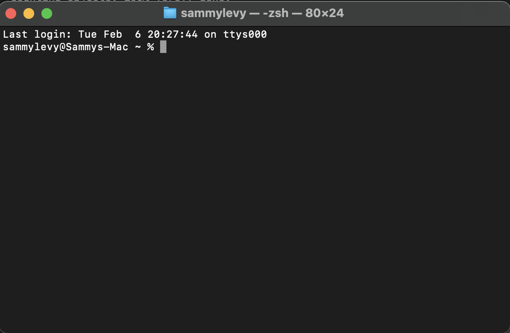
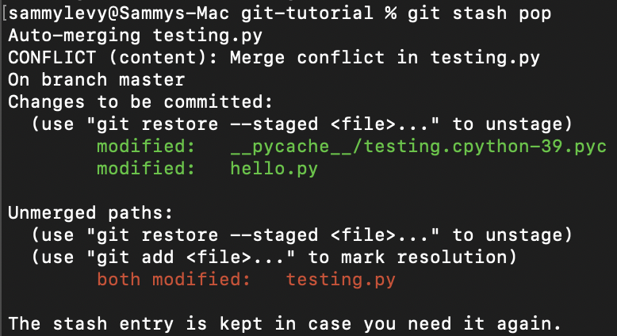

## Introduction
This is a tutorial on the basics of using Git for version control in the command line. Created for my Computer Science Junior Seminar, Spring 2024.
## Required Applications
This tutorial uses the default terminal on a computer running MacOS. Vim and Python3 are required to follow along with the tutorial. In my environment, Python3 is run using the command `python3`; if this doesn't work in yours, try `python`. This tutorial also assumes you have an account on [GitHub](github.com) -- if you don't, setting one up is straightforward.
## Initializing a Project
We will be exclusively using the command line for this project. Let's start by creating the directory and files we will be working on, and initializing Git.
### Create a directory
Open the "Terminal" application. You should be met with a blank window that looks like this (with your login information, not mine!): 
Navigate to the directory you want your project to be stored in with `cd [FILEPATH]`, replacing `[FILEPATH]` with the path. Alternatively, you can stay in the home directory. Create a new directory at this location:
```shell
mkdir git-tutorial
```
And enter that directory:
```shell
cd git-tutorial
```
### Create a file
Now that we have a directory for our project, lets create a new file before initializing Git. Create a new python file:
```shell
touch hello.py
```
Next, we'll edit the file using Vim. Vim is a command line text editor that can do everything we need! Open the file with the following command:
```shell
vim hello.py
```
Press `i` to put Vim in insert mode to start editing the file. Add the following line to the python file:
```python
print("hello!")
```
That's all we want to add for now, so let's exit Vim. Press `esc` to exit insert mode, then type `:wq` to save the file and exit Vim.
### Test the file
Let's see what this file does! In the command prompt, type:
```shell
python3 hello.py
```
You should see the following output:
```Output
hello!
```
### Initialize Git
Here's where the real fun begins. We'll initialize this project as a local Git repository:
```shell
git init
```
Git is a version control system that allows us to save changes, track a project's history, create multiple feature branches, and much more. Let's take a deeper look at what we can do with Git, how we can do it, and why.
## Committing Your Changes
Committing is how we save changes in Git. Any files that are added, deleted, or edited are added to a list of changes to be committed. Commit your changes often and leave clear messages with them that describe what you changed. Let's make our first commit.
### Create an initial commit
In the command prompt, enter:
```shell
git status
```
This will give you a list of all staged changes (green) and unstaged/untracked changes (red). Notice that our file `hello.py` is currently untracked. This means that this file has not yet been part of a commit, and its changes are not being tracked by Git. Let's add it to our commit:
```shell
git add hello.py
```
If you run `git status` again, you'll see that `hello.py` is now staged. Now let's make the actual commit:
```shell
git commit -m "initial commit"
```
We add our commit message as an argument to the command `git commit` by using `-m "MESSAGE"`. The message is just a label that explains what we did in the commit. In this case, "initial commit" works as the message, as we haven't yet done much.
### Edit a file
Let's edit our file a bit. Open up Vim:
```shell
vim hello.py
```
Press `i` to insert, and add the following lines to the file just below the first print statement:
```python
print("io triumphe!")
print(9+10)
```
Hit `esc`, then `:wq` to save your work. You should see the following output:
```output
hello!
io triumphe!
19
```
### Commit your changes
Now that we've made some more changes, it's time to commit them. If you want to see which files are staged, you can run `git status` again. It's not necessary here, as we only made changes on one file, but this would be more useful if you had more files to track, or if wanted to make sure certain files were staged but not others, for example.   

Because we `hello.py` exists in a previous commit, it is no longer untracked. However, the changes we made to it are currently unstaged, so let's add them to the commit:
```shell
git add hello.py
```
Everything is staged, so let's commit:
```shell
git commit -m "added new print statements"
```
### Make more changes and commit
Let's make things a little more complicated for our next commit. Create a new file:
```shell
touch testing.py
```
And open it in Vim:
```shell
vim testing.py
```
As before, press `i` to enter insert mode and add the following function:
```python
def secondfile():
	print("this function is from testing.py!")
```
Hit `esc` and type `:wq` to save the file. Back to `hello.py`, let's reopen it in Vim and make some changes. Add the new lines to your code so it looks like this:
```python
import testing

print("hello!")
print("io triumphe!")
print(9 + 10)

testing.secondfile()
```
Run the file in the command prompt:
```shell
python3 hello.py
```
And it should produce the following output:
```Output
hello!
io triumphe!
19
this function is from testing.py!
```

If we run the command `git status`, you'll see that neither of the files are staged. Note that `testing.py` is untracked because it is new, but `hello.py` is tracked and unstaged. We can stage both of these files together with:
```shell
git add .
```
The `.` argument in place of a file name stages everything that is currently unstaged. Let's commit one more time:
```shell
git commit -m "created second file"
```
Remember to commit often! Git is just like any word processor or video game -- save often so you don't lose your work!
## Stashing and Branching
Git allows you to create multiple branches of commits for working on different features, experimenting, separating the work of different collaborators, and more. In this section, we'll look at how branches and stashing work.
### Make some changes
Reopen `testing.py` in Vim:
```shell
vim testing.py
```
Press `i` to insert, and add the following function beneath your print statement:
```python
def add_two_nums(a, b):
	return(a + b)
```
Hit `esc`, then `:wq` to save your work. Now, call this function from `hello.py` by reopening it in Vim:
```shell
vim hello.py
```
Append the following lines to the bottom of your code:
```python
a = 6
b = 15
print("the sum of", a, "and", b, "is", testing.add_two_nums(a, b))
```
Hit `esc`, then `:wq` to save your work. Run the file:
```shell
python3 hello.py
```
And you'll see the following output:
```Output
hello!
io triumphe!
19
this function is from testing.py!
the sum of 6 and 15 is 21
```
### Stash those changes
What if you don't actually want to commit those changes now? Let's stash the changes: this will remove the changes from the working tree, but save them to be restored later if you want. Run the following command:
```shell
git stash
```
After this, if you run `git status`, you'll see that the working tree is clean, despite the fact that we didn't commit these changes. In fact, if you run the file with `python3 hello.py`, you'll see that the last line of the output is missing. The files are reverted to their status at the previous commit without any edits. In a bit you will see why this is a necessary step before branching (in fact, Git won't let you switch branches without a clean working tree).
### Make a branch
One reason to make a branch may be to make experimental changes without effecting the main branch. Make a new branch called "new-branch" to make some changes on:
```shell
git branch new-branch
```
Now that we have a new branch, run the command without any arguments to see a list of all branches:
```shell
git branch
```
The branch you are currently on will be highlighted. Creating a branch doesn't switch which branch you're on. Instead, you have to do that manually:
```shell
git switch new-branch
```
If we hadn't committed or stashed our previous changes, this command would fail. But we're one step ahead and already stashed everything, so this should work! Run `git branch` one more time if you want to confirm that you're on the correct branch.
### Make some changes and commit on the new branch
On this new branch, we'll make some changes to `testing.py`. Open it in Vim:
```shell
vim testing.py
```
Press `i` to insert, and change line 2 to the following:
```python
print("now we're on a new branch!")
```
Hit `esc` and type `:wq` to save and exit Vim. Commit your changes:
```shell
git add .
git commit -m "changed line 2 in testing.py on the new branch"
```
### Switch branches
Switch back to the main branch, called master in our case:
```shell
git switch master
```
### Make some changes and commit on the main branch
Now that we're back on the main branch, let's change the same line that we changed on our other branch. Open the file up in Vim:
```shell
vim testing.py
```
Press `i` to insert, and change line 2 to the following:
```python
print("this is the main branch!")
```
Hit `esc` and type `:wq` to save and exit Vim. Commit your changes:
```shell
git add .
git commit -m "changed line 2 in testing.py on the main branch"
```
## Merging
We're done making changes on the new branch and won't be using it again, so let's add those changes back to the master branch. To do that, we will need to either `merge` or `rebase` the new branch onto the master. This tutorial will show how to `merge`, though the process required to `rebase` is very similar.
### Merge new branch into main
Make sure that you're on the main branch. Use `git branch` to confirm, and `git switch` if you need to change branches. Let's attempt the merge. The following command will merge the selected branch into the current branch:
```shell
git merge new-branch
```
Oh look, it didn't work. You likely got some sort of error message mentioning something about a "merge conflict". This happens when the same line is edited on the same file on two different branches. Notice that the file with the merge conflict is `testing.py`, and that there are no errors with `hello.py`. Let's try to resolve these conflicts.
### Resolve conflicts
Open `testing.py` with Vim to see what the conflict is:
```shell
vim testing.py
```
Notice that the file looks a bit different than the last time you opened it. In order to help you resolve the merge conflict, markers (`<<<<<<` at the beginning, `======` between the differences, `>>>>>>` at the end ) were added to show you where the difference is. From here, it's up to you to choose how to resolve the conflict. Press `i` to insert, and make any changes to the file that you'd like. For the purposes of this tutorial, keep the changes from both branches, but delete the markers. Your `testing.py` file should look like this:
```python
def secondfile():
	print("this is the main branch!")
	print("now we're on a new branch!")
```
As usual, hit `esc` and `:wq` to save and exit Vim. Now that we've resolved the merge conflict, let's stage our changes and commit the merge:
```shell
git add .
git commit-m "resolved merge conflict, kept both lines"
```
### Restore changes from stash
This next step is not part of the merging process, but it is helpful to see what our stashed changes look like now that we have changed multiple files on different branches. First, restore the changes from the stash to the working tree:
```shell
git stash pop
```
After running this command, you will likely be met with an output that looks like this:

Similar to the conflict we encountered while merging branches, there is also a conflict while trying to merge the stashed changes with the current branch. Like before, let's reopen `testing.py` in Vim to see what the conflict is:
```shell
vim testing.py
```
Press `i` to insert, and make any changes you want. I chose to keep everything, but feel free to choose one version or the other if you wish. Also, note that not all of `testing.py` has this conflict; the only lines that cause an issue are the ones that are changed in both versions. The second function added below the print statements should be left alone. Make sure to delete the markers before exiting Vim. Hit `esc` and `:wq` to save and exit when you're finished. Finally, commit your changes:
```shell
git add .
git commit -m "add stashed changes"
```
## GitHub
Git is great for tracking changes and branching on a local machine, but what if you want to collaborate with others? Or, what happens if your computer breaks or is stolen? By keeping everything local, you run the risk of losing everything, despite your version control efforts. This is where GitHub comes in: by storing your changes in a remote repository, you are able to easily collaborate with others and back your code up externally. Let's take a look at how to put this existing project up on GitHub.
### Create repository on GitHub
Navigate to [github.com](github.com) using your favorite web browser and sign in. Create a new public repository, name it "git-tutorial", and make sure to choose the correct menu options for the following:
- No readme
- No license
- No gitignore   
Click the button to continue. On the next screen, you should see a link to copy the remote repository URL (ending in `.git`). Copy that to your clipboard.
### Set up origin
Back in terminal, make sure you're in the correct project directory. If not, use `cd [FILEPATH]` to return. Next, enter the following into the command prompt, but replace `[REMOTE-URL]` with the URL you copied in the previous step:
```shell
git remote add origin [REMOTE-URL]
```
If this works properly, you should see no output. Confirm that this is working properly with the command `git remote -v`.
### Push changes to GitHub
The first time we push to GitHub, we'll use the following command:
```shell
git push -u origin master
```
This pushes the entire commit history of the master branch to GitHub. As mentioned before, if the name of your main branch is not `master`, replace that argument with the name of your main branch. This process could be repeated for the `new-branch` branch we used previously, or for any other branch in the future, by replacing the final argument with the name of the branch.   
From here on, every time you want to push your commits to GitHub, you just need to use the command:
```shell
git push
```

### GitHub Workflow
To keep the code on your local machine consistent with GitHub, make sure to push when you commit. After making changes to your code, this is what your commit process will generally look like:
```shell
git add .
git commit -m "message"
git push
```
This tutorial does not go into depth about how to collaborate with others on GitHub, but it may be helpful to be aware of the command `git pull`, which pulls all changes and commits from GitHub and merges them with your local commit history. When working with others, this unsurprisingly (and often) this leads to merge conflicts -- but you know how to deal with those!
## Conclusion
And that's it! You should now have the tools to create both a local repository on your computer and a remote repository on GitHub.
## Quick Command Reference
A brief summary of all of the commands covered here, as well as a few more!   

`cd [DIRECTORY]` changes your current directory.   
`mkdir [DIRECTORY NAME]` creates a new directory at your current location.   
`touch [FILENAME]` creates a new file at your current location.   
`vim [FILENAME]` opens a file in Vim. Press `i` to enter insert mode, `esc` to exit, and `:wq` to save and quit. I use Vim here because it is the command line text editor that I'm most familiar with. For more information and a quick shortcut/command reference, check out https://vim.rtorr.com/.   
`python3 [FILENAME].py` runs a python file.   
<br>
`git init` creates a new local git repository at your current location.   
`git status` shows you the current status of your working tree: files that are untracked, changes that are staged and unstaged, etc.   
`git add [FILENAME]|.` stages the desired file, or stages all changes by using `.`.   
`git commit -m "MESSAGE"` creates a new commit on the current branch with the desired message.   
`git stash` saves all changes on the working tree without creating a new commit. This is necessary to switch branches without committing. `git stash pop` restores the most recently stashed changes to the working tree.   
`git branch [BRANCH NAME]` creates a new branch. Without the branch name, `git branch` lists all branches.    
`git switch [BRANCH NAME]` switches the working directory to the desired branch.
`git merge [BRANCH NAME]` merges a desired branch into the current branch. This is done by using the last commits from both branches as parent commits and attempting to combine them. Often, this will result in conflicts that can be solved using Vim or another text editor.   
`git rebase [BRANCH NAME]` takes the commit history of one branch and effectively "replays" it onto the most recent commit of the current branch. This can also result in conflicts that the user must solve using Vim or another text editor.   
`git log` shows you the full commit history of your project.   
`git log --graph` shows you the same information, but split into branches.   

